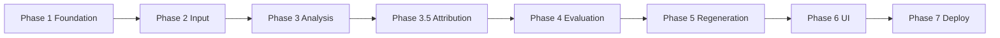
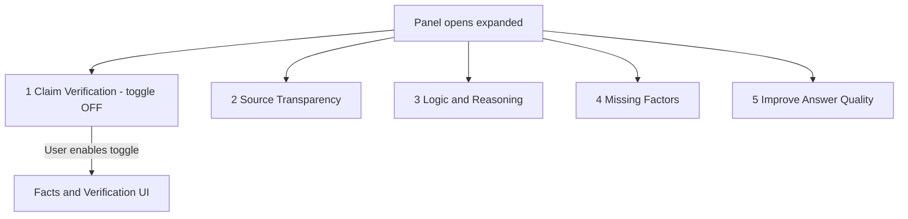
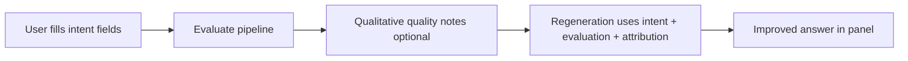

# AI Output Evaluation Tool — Architecture Index

This documentation set defines how to build the **AI-Powered Output Evaluation & Improvement Tool** described in [`problemstatement.md`](../problemstatement.md).

## Product rules (read first)

| Rule | Detail |
|------|--------|
| **Panel opens with all 5 dimensions** | The evaluation panel is **expanded by default** and always shows all five evaluation dimensions (not a subset). Users see the full framework immediately. |
| **Claim verification is opt-in** | **Facts & Verification** (highlights, verified / needs verification) runs **only** when the user turns on the **Claim Verification** toggle. Default: **off**. Other dimensions do not depend on this toggle. |
| **No scoring anywhere** | No numeric scores, confidence percentages, star ratings, or 1–5 rubrics in API payloads, LLM prompts, or UI. Use **status labels**, **narrative notes**, and **structured attribution** only. |
| **Attribution chain** | Phase 3 extracts structure; **Phase 3.5** links each claim through reasoning → source → evidence (see below). |

### Five evaluation dimensions (always visible in panel)

1. Claim Verification *(toggle-controlled; off by default)*
2. Source Transparency
3. Logic & Reasoning Check
4. Missing Factors — *[display rules in §7](#7-evaluation-dimensions-display--input-rules)*
5. Improve Answer Quality — *[intent form + regeneration in §7](#7-evaluation-dimensions-display--input-rules)*

---

## How to use these docs

| Order | Document | Purpose |
|-------|----------|---------|
| 0 | [Architecture Overview](./Architecture_Overview.md) | End-to-end system, stack, boundaries, non-goals |
| 1 | [Phase 1 — Foundation & Data Model](./Phase_1_Foundation.md) | Repo layout, schemas, API contracts, config |
| 2 | [Phase 2 — Input Collection](./Phase_2_Input_Collection.md) | Capturing prompt, response, sources, criteria |
| 3 | [Phase 3 — Response Analysis](./Phase_3_Response_Analysis.md) | Explicit extraction: claims, assumptions, reasoning steps |
| 3.5 | [Phase 3.5 — Source Attribution Engine](./Phase_3_5_Source_Attribution.md) | Per-claim chain: Claim → Reasoning → Source → Evidence |
| 4 | [Phase 4 — Evaluation Engine](./Phase_4_Evaluation_Engine.md) | Qualitative dimension outputs (no scoring) |
| 5 | [Phase 5 — Regeneration Engine](./Phase_5_Regeneration.md) | Improved answer + change summary |
| 6 | [Phase 6 — UI & Panel](./Phase_6_UI_Panel.md) | Expandable panel, 5 dimensions, claim verification toggle |
| 7 | [Phase 7 — Integration & Deployment](./Phase_7_Integration_Deployment.md) | Auth, observability, CI/CD, hosting |
| — | [Edge Cases & Quality Bar](./EdgeCases.md) | Failure modes, limits, UX guardrails |

---

## Build sequence (recommended)



Phases 3–5 can be developed against **mock structured JSON** before the UI is complete. Phase 6 should consume stable API response shapes from Phase 1 contracts.

**Pipeline order:** `Analysis (3) → Source Attribution (3.5) → Evaluation (4) → Regeneration (5)`.

---

## Panel default UX (Phase 6)



- All **five dimension sections** are visible when the panel opens; content may show guidance until the user runs **Evaluate**.
- **Claim Verification** section shows a dedicated **toggle** (e.g. “Enable claim verification”). While off: no pastel highlights on the response, no verified / needs-verification spans; other sections still run on evaluate.
- When the toggle is **on** and the user evaluates: Phase 4 runs the claim verification module and the UI applies green / yellow highlights per [`Phase_6_UI_Panel.md`](./Phase_6_UI_Panel.md).

---

## Core user journey (reference)

1. User opens the app; the **evaluation panel is expanded** with **all 5 dimensions** listed.
2. User pastes the AI response (+ optional prompt and context). Optionally turns **on** Claim Verification.
3. User fills **Improve Answer Quality** intent fields (intent, expertise, goal, constraints, good-answer definition) and adjusts **source type** checkboxes.
4. User runs **Evaluate** (and regenerate when enabled).
5. System runs **Analysis (3) → Source Attribution (3.5) → Evaluation (4) → Regeneration (5)** using intent for the rewrite.
6. Results appear in the panel: attribution, sources, reasoning, **compact missing-factor headings**, and **intent-tailored** improved answer—**without numeric scores**.

---

## Attribution chain (Phase 3.5 summary)

For every claim, the system builds:

```text
Claim → Reasoning Step → Source → Evidence
         └── Assumption (Derived From, Supporting Evidence, Counter Evidence)
```

Example: see [Phase 3.5 — Source Attribution Engine](./Phase_3_5_Source_Attribution.md).

---

## 7. Evaluation dimensions (display & input rules)

Dimensions **1–3** follow [Phase 6 UI](./Phase_6_UI_Panel.md) and [Phase 4](./Phase_4_Evaluation_Engine.md). Dimensions **4** and **5** have additional product rules below.

### 4. Missing Factors — display only (compact)

**Purpose:** Surface gaps in the original AI answer without overwhelming the user.

**UI rule:** Each missing factor is shown as **only**:

| Element | Limit |
|---------|--------|
| **Heading** | Short category title (e.g. “Competitor Analysis”, “Store Economics”) |
| **Explanation** | **1–2 lines** maximum describing what is missing |

**Do not show** in this section: long paragraphs, suggested uploads, severity labels, bullet lists of sub-points, or expandable essays. Regeneration uses `answer_quality_intent` plus compact `missing_factors` summaries—not extra copy in this UI block.

**Example (correct):**

```text
Competitor Analysis
No evaluation of nearby competitors or their footprint in the target area.
```

**Example (incorrect):** Multi-paragraph analysis, “Suggested: add file…”, or more than two lines of body text under the heading.

**API shape (evaluation output):**

```json
{
  "missing_factors": [
    {
      "heading": "Cannibalization Risk",
      "summary": "Impact on existing Bangalore stores is not discussed."
    }
  ]
}
```

Phase 4 prompts must enforce `summary` length ≤ ~2 lines (≈200 characters). See [Phase 4 §4.5](./Phase_4_Evaluation_Engine.md).

---

### 5. Improve Answer Quality — user intent, then regenerate

**Purpose:** Produce an improved answer tailored to **who the user is**, **what they want**, and **what “good” means for them**—not a generic rewrite.

#### 5a. Collect before regenerate (panel form)

In the **Improve Answer Quality** section, show inputs **before** the user runs evaluate/regenerate (fields may be optional but recommended):

| Field | Prompt label (example) | Maps to |
|-------|------------------------|---------|
| User intent | What are you trying to decide or understand? | `answer_quality_intent.user_intent` |
| Expertise level | What is your expertise on this topic? | `answer_quality_intent.expertise_level` |
| User goal | What outcome do you need from this answer? | `answer_quality_intent.user_goal` |
| Constraints or expectations | Any constraints, deadlines, budget, or boundaries? | `answer_quality_intent.constraints_or_expectations` |
| Good answer looks like | What should a good answer look like for you? | `answer_quality_intent.good_answer_looks_like` |

**Expertise level** may be a select (`beginner` / `intermediate` / `expert`) or free text.

These fields are sent on `POST /api/v1/evaluate` (and `/regenerate`) inside `answer_quality_intent`. Regeneration **must** treat them as primary steering signals (tone, depth, structure, what to include/omit).

#### 5b. Flow



#### 5c. Regeneration behavior (summary)

- **Match expertise:** beginner → plain language, definitions; expert → dense, assumes background.
- **Match goal & intent:** e.g. decision memo vs learning overview vs executive summary.
- **Honor constraints:** budget caps, geography, time horizon, “no speculation”, etc.
- **Mirror `good_answer_looks_like`:** format (bullets vs narrative), length, sections user asked for.
- Still respect source preferences, attribution chains, and no fabricated citations ([Phase 5](./Phase_5_Regeneration.md)).

#### 5d. Section layout after run

| Block | When shown |
|-------|------------|
| Intent form (editable) | Always in dimension 5 |
| Qualitative notes | After evaluate (`answer_quality.*_note`) — brief, optional |
| Improved answer | After regenerate |
| Changes summary | After regenerate |

Schema: [`Phase_1_Foundation.md`](./Phase_1_Foundation.md) (`answer_quality_intent`, compact `missing_factors`).
