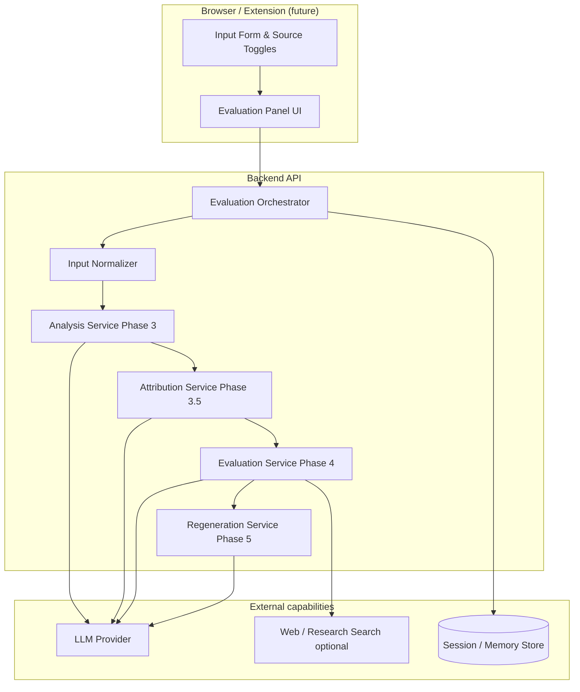
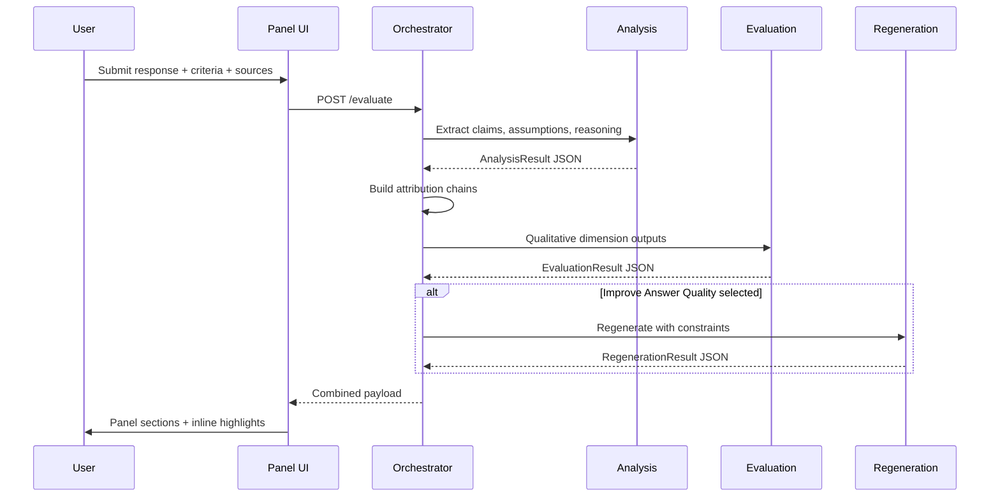

# Architecture Overview

## 1. Problem summary

Build a web application that evaluates ChatGPT (or similar) outputs across quality dimensions—factual accuracy, source reliability, reasoning, missing factors, and answer usefulness—and optionally produces an improved answer. Results appear in an **expandable panel** beside the original text with **actionable, transparent** findings.

## 2. Design principles

| Principle | Implication |
|-----------|-------------|
| **Transparency** | Every verdict links to evidence or states uncertainty explicitly. |
| **User control** | Source types are user-selected; **claim verification is opt-in** via toggle (default off). |
| **All five dimensions visible** | Panel opens expanded with every dimension shown; not a pick-list of 3-of-5. |
| **No scoring** | No numeric scores, confidence %, or 1–5 rubrics in API or UI—labels and narrative only. |
| **Structured first** | Pipelines produce JSON artifacts; UI renders those artifacts. |
| **Separation of concerns** | Analysis → Attribution → Evaluation → Regeneration are distinct services. |
| **Fail safe** | When verification is impossible, mark as *needs verification*—never silently “verified”. |

## 3. Logical architecture



## 4. Technology recommendations

| Layer | Recommendation | Rationale |
|-------|----------------|-----------|
| **Frontend** | React + Vite (or Next.js App Router) | Component model fits panel + inline highlights. |
| **Styling** | Tailwind CSS | Fast iteration on pastel highlights and layout. |
| **Backend** | Python FastAPI | Async-friendly, strong typing with Pydantic. |
| **LLM** | OpenAI / Anthropic via unified adapter | Swap models without changing orchestration. |
| **Structured output** | JSON schema + `response_format` / tool calling | Reliable claim lists and evaluation objects. |
| **Search (optional)** | Tavily, Serper, or Bing API | Claim verification against web sources. |
| **Persistence** | SQLite (dev) → PostgreSQL (prod) | Sessions, evaluation runs, uploaded file refs. |
| **File uploads** | Local disk (dev) → S3-compatible (prod) | User-provided context documents. |

## 5. Repository layout (target)

```
.antigravity/
├── problemstatement.md
├── Docs/                          # Architecture (this folder)
├── frontend/
│   ├── src/
│   │   ├── components/panel/      # Expandable evaluation panel
│   │   ├── components/highlights/ # Claim span rendering
│   │   ├── hooks/                 # useEvaluation, useRegenerate
│   │   └── api/                   # Typed API client
│   └── package.json
├── backend/
│   ├── app/
│   │   ├── main.py                # FastAPI app
│   │   ├── orchestrator.py        # Pipeline coordinator
│   │   ├── models/                # Pydantic schemas
│   │   ├── services/
│   │   │   ├── analysis.py
│   │   │   ├── attribution.py
│   │   │   ├── evaluation.py
│   │   │   └── regeneration.py
│   │   └── adapters/              # LLM, search, storage
│   ├── tests/
│   └── requirements.txt
├── .env.template
└── README.md
```

## 6. Primary API surface

| Method | Path | Description |
|--------|------|-------------|
| `POST` | `/api/v1/evaluate` | Full pipeline: analyze → attribute → evaluate (+ optional regenerate). |
| `POST` | `/api/v1/analyze` | Phase 3 extraction only. |
| `POST` | `/api/v1/attribute` | Phase 3.5 attribution chains only. |
| `POST` | `/api/v1/regenerate` | Regenerate using prior `evaluation_id`. |
| `GET` | `/api/v1/evaluations/{id}` | Fetch stored run for panel replay. |
| `POST` | `/api/v1/uploads` | User context files (PDF/text). |

Long-running evaluate calls should support **SSE** or **202 + poll** if total latency exceeds ~30s.

## 7. Evaluation dimensions (product constants)

The panel always shows **5 dimensions**; claim verification **highlights** require the user toggle (default off):

1. **Claim Verification** — optional labels: verified / needs verification / unsupported (toggle-gated).
2. **Source Transparency** — which sources were used; trust and gaps.
3. **Logic & Reasoning Check** — conclusion follows evidence; gaps; alternatives.
4. **Missing Factors** — **heading + 1–2 line** summary per gap only in UI (see [Index §7](./00_Architecture_Index.md#7-evaluation-dimensions-display--input-rules)).
5. **Improve Answer Quality** — collect **user intent, expertise, goal, constraints, good-answer definition**; regenerate accordingly ([Index §7](./00_Architecture_Index.md#7-evaluation-dimensions-display--input-rules)).

## 8. Source categories (product constants)

Each category is a boolean toggle (user can uncheck):

| Key | Label |
|-----|-------|
| `memory` | Memory — prior conversations, saved preferences |
| `user_context` | User-provided — uploads, links, prompt info |
| `web` | Web — blogs, news, websites |
| `research` | Research & reports — whitepapers, academic |
| `company` | Company — official sites, investor reports, PR |
| `internal` | Internal knowledge — model knowledge without retrieval |
| `custom` | Add your own source (free text + optional URL) |

Evaluation and regeneration **must respect** disabled source types (e.g. do not cite web if `web` is unchecked).

## 9. Data flow (single evaluate request)



## 10. Security & privacy (baseline)

- Do not log full prompts/responses in production without consent; redact PII in traces.
- API keys only on server; never expose LLM keys to the browser.
- Uploaded files: virus scan hook (future), size limits, MIME allowlist.
- Rate limit `/evaluate` per IP/session.

## 11. Non-goals (v1)

- Browser extension that injects into ChatGPT DOM (optional Phase 8).
- Real-time collaborative editing.
- Automated fact database curation beyond retrieved search snippets.
- Legal/compliance certification of financial advice.

## 12. Success metrics

| Metric | Target |
|--------|--------|
| End-to-end evaluate (no search) | p95 < 45s |
| Claim extraction recall | Manual audit ≥ 80% on sample set |
| User comprehension | Users can name 1+ assumption from panel without re-reading full answer |
| Regeneration usefulness | Qualitative review ("helpful" / "not helpful") — no numeric rubric |

## 13. Deployment guide

### 13.1 Environment configuration

**Critical: Disable mock mode for production**

The application supports two modes:

| Mode | `MOCK_MODE` | Behavior | Use case |
|------|-------------|----------|----------|
| **Development** | `true` | Returns mock evaluation data without calling LLM APIs | Local development, testing, demos |
| **Production** | `false` | Calls live LLM APIs (Groq/OpenAI/Anthropic) | Deployed applications |

**⚠️ IMPORTANT: You MUST set `MOCK_MODE=false` before deploying to production.**

```bash
# Development (default)
MOCK_MODE=true

# Production (REQUIRED for deployment)
MOCK_MODE=false
GROQ_API_KEY=your_production_api_key_here
```

### 13.2 Backend deployment (Streamlit)

The FastAPI backend can be deployed using **Streamlit Cloud** or similar Python hosting:

**Steps:**
1. Create a Streamlit app at [share.streamlit.io](https://share.streamlit.io)
2. Connect your GitHub repository
3. Set environment variables in Streamlit secrets:
   ```toml
   MOCK_MODE = "false"
   GROQ_API_KEY = "gsk_your_production_key"
   LLM_PROVIDER = "groq"
   LLM_MODEL_ANALYSIS = "llama-3.1-8b-instant"
   LLM_MODEL_EVAL = "llama-3.3-70b-versatile"
   LLM_MODEL_REGEN = "llama-3.3-70b-versatile"
   CORS_ORIGINS = "https://your-vercel-app.vercel.app"
   ```
4. Deploy and note your backend URL (e.g., `https://your-app.streamlit.app`)

**Alternative deployments:**
- **Railway/Render**: Use Dockerfile or `uvicorn app.main:app`
- **AWS/GCP/Azure**: Deploy FastAPI with ASGI server (uvicorn/gunicorn)

### 13.3 Frontend deployment (Vercel)

The React frontend deploys seamlessly to Vercel:

**Steps:**
1. Push your code to GitHub
2. Import project at [vercel.com/new](https://vercel.com/new)
3. Set environment variables:
   ```bash
   VITE_API_BASE=https://your-streamlit-app.streamlit.app
   ```
4. Deploy and Vercel will provide a URL (e.g., `https://your-app.vercel.app`)

**Configuration:**
- Framework Preset: **Vite**
- Root Directory: **frontend**
- Build Command: `npm run build`
- Output Directory: `dist`

### 13.4 Production checklist

Before deploying to production:

- [ ] Set `MOCK_MODE=false` in backend environment
- [ ] Configure valid `GROQ_API_KEY` (or other LLM provider)
- [ ] Update `CORS_ORIGINS` to include your Vercel frontend URL
- [ ] Set `VITE_API_BASE` in frontend to point to deployed backend
- [ ] Test full evaluation pipeline with live LLM calls
- [ ] Verify claim verification highlights work (green/yellow)
- [ ] Check file upload and URL inputs function correctly
- [ ] Ensure regeneration produces improved answers
- [ ] Review rate limiting and error handling
- [ ] Set up monitoring/logging for LLM API calls

### 13.5 Cost considerations

| Component | Cost estimate (production) |
|-----------|----------------------------|
| **LLM API (Groq)** | ~$0.05-0.20 per evaluation (depends on response length) |
| **Streamlit Cloud** | Free tier available; Pro $20/month |
| **Vercel** | Free tier (hobby); Pro $20/month |
| **Web Search (optional)** | $0-50/month depending on volume |

**Optimization tips:**
- Cache evaluation results for repeated queries
- Use smaller models for analysis (llama-3.1-8b) vs evaluation (llama-3.3-70b)
- Implement request queuing to avoid rate limits

See phase documents for implementation detail per layer.
