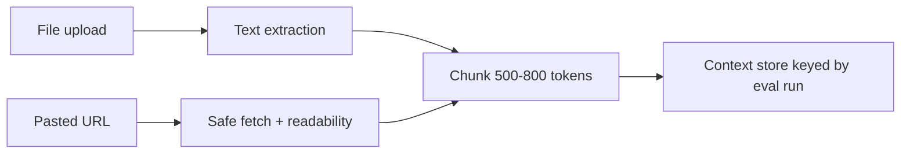

# Phase 2 — Input Collection

**Goal:** Capture everything the evaluation pipeline needs from the user and normalize it into `EvaluationRequest`.

**Depends on:** Phase 1 schemas.

**Exit criteria:** User can submit all inputs from UI or API; server validates, persists optional session, returns `evaluation_id` when async.

---

## 2.1 Input surfaces

### A. Evaluation panel (opens **expanded** with all 5 dimensions)

The panel **always displays** all five evaluation dimensions on open (see [Architecture Index](./00_Architecture_Index.md)). Users do not pick a subset of dimensions.

| Control | Maps to |
|---------|---------|
| Textarea: AI response | `ai_response` |
| Textarea: Your question (optional) | `user_query` |
| Fixed list: 5 dimensions (always sent in `criteria`) | all `Criteria` enum values |
| **Toggle: Enable claim verification** (default **OFF**) | `claim_verification_enabled` |
| Checkboxes: Source categories | `source_preferences` |
| “Add your own source” | `custom_sources[]` |
| File upload / paste links | `user_context` |
| Paste citations from ChatGPT | `citations[]` |
| Toggle: Run regeneration | `regenerate` |
| **Improve Answer Quality** intent fields (see Index §7) | `answer_quality_intent` |

### B. Conversation memory (optional v1.1)

- Load last N turns from `conversation_id` when `memory` enabled.
- Store in DB: `conversations`, `messages` tables.

---

## 2.2 Validation rules

| Rule | Error |
|------|-------|
| `ai_response` non-empty | 400 `EMPTY_RESPONSE` |
| `criteria` must include all 5 dimensions | 400 `INCOMPLETE_DIMENSIONS` |
| `claim_verification_enabled` omitted | Default `false` |
| Response length > `MAX_RESPONSE_CHARS` | 413 with truncate suggestion |
| Upload > 10MB or disallowed MIME | 400 `INVALID_UPLOAD` |

---

## 2.3 User context handling



**Extractors:**

- `.txt`, `.md` — raw read
- `.pdf` — `pypdf` or similar
- URLs — fetch with timeout, strip HTML to text, respect robots (best effort)

**Security:** SSRF protection on URL fetch (block private IPs, file://).

---

## 2.4 Citations normalization

If user pastes ChatGPT-style references:

```json
{
  "citations": [
    { "index": 1, "title": "...", "url": "...", "raw": "..." }
  ]
}
```

Map citation indices to claim IDs during evaluation when response contains `[1]` markers.

---

## 2.5 Custom sources

```json
{
  "label": "Internal sales dashboard Q1",
  "url": null,
  "notes": "Bangalore footfall up 12% YoY"
}
```

Passed to evaluation as `source_type: "custom"` with high user trust weight.

---

## 2.6 API: input-only endpoints

| Endpoint | Purpose |
|----------|---------|
| `POST /api/v1/uploads` | Returns `file_id` for `user_context.attachments` |
| `POST /api/v1/evaluate` | Validates + starts pipeline |

**Request body example:**

```json
{
  "user_query": "Should SNITCH open another store in Bangalore?",
  "ai_response": "Bangalore is likely the strongest market...",
  "criteria": [
    "claim_verification",
    "source_transparency",
    "logic_reasoning",
    "missing_factors",
    "improve_answer_quality"
  ],
  "claim_verification_enabled": false,
  "source_preferences": {
    "memory": false,
    "user_context": true,
    "web": true,
    "research": true,
    "company": true,
    "internal": false
  },
  "custom_sources": [],
  "user_context": {
    "file_ids": [],
    "pasted_text": ""
  },
  "regenerate": true,
  "answer_quality_intent": {
    "user_intent": "Decide whether to open another store in Bangalore.",
    "expertise_level": "intermediate",
    "user_goal": "Clear go/no-go recommendation.",
    "constraints_or_expectations": "Under 500 words; cite only provided sources.",
    "good_answer_looks_like": "Executive summary, then risks, then recommendation."
  }
}
```

---

## 2.7 Frontend state

```typescript
interface EvaluationFormState {
  aiResponse: string;
  userQuery: string;
  criteria: Criteria[]; // always all 5
  claimVerificationEnabled: boolean; // default false
  answerQualityIntent: AnswerQualityIntent;
  sourcePreferences: SourcePreferences;
  customSources: CustomSource[];
  attachments: File[];
  regenerate: boolean;
  status: 'idle' | 'submitting' | 'processing' | 'done' | 'error';
}
```

Persist draft in `sessionStorage` to avoid loss on refresh.

---

## 2.8 UX requirements (from problem statement)

- Panel opens **expanded** with all **5 dimension** sections visible (labels: Claim Verification, Source Transparency, Logic & Reasoning Check, Missing Factors, Improve Answer Quality).
- **Claim Verification** section contains an **Enable claim verification** toggle (default off). Highlights and verification labels apply only when on.
- Source section mirrors checkbox list with ability to **uncheck** before evaluate.
- Clear CTA: **Evaluate response** (disabled until `ai_response` is non-empty).
- **No scoring UI** (no sliders, stars, percentages, or 1–5 controls).

---

## 2.9 Tasks checklist

- [x] Build form components + validation
- [x] Wire `POST /evaluate` with loading states
- [x] Implement upload endpoint + extraction pipeline
- [x] URL paste handler with SSRF-safe fetcher
- [x] Session draft persistence
- [x] Unit tests for validation middleware

## 2.10 UI preview (Phase 6 features)

Phase 2 includes a **preview** of claim highlights and expandable reasoning using mock API data:

| Feature | Requires |
|---------|----------|
| Green / yellow / red highlights | **Claim verification ON** + **Evaluate** + `analysis.claims[].span` + `evaluation.claims[]` |
| Expandable reasoning steps | **Evaluate** + `evaluation.logic.reasoning_path` |

Full Phase 6 polish (hover cards, mobile layout, stepper) ships in Phase 6.
