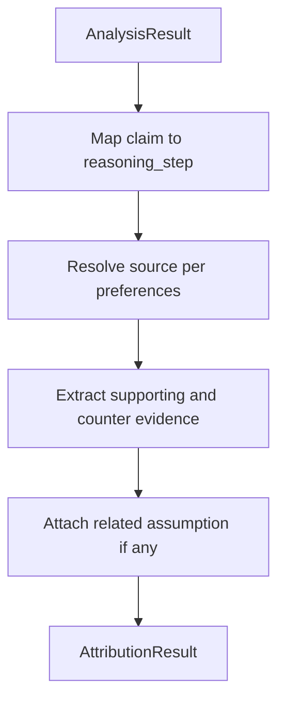

# Phase 3.5 — Source Attribution Engine

**Goal:** For **every claim** from Phase 3, build a traceable **attribution chain** linking the claim to reasoning, sources, and evidence—including assumptions with supporting and counter evidence.

**Depends on:** Phase 3 `AnalysisResult` (claims, assumptions, reasoning_steps), Phase 2 source preferences and user context.

**Runs before:** Phase 4 Evaluation (which consumes `AttributionResult` for qualitative outputs).

**Exit criteria:** Each claim has a complete chain or an explicit `attribution_gap` note; no numeric scores in output.

---

## 3.5.1 Purpose

Users need to see **where each claim comes from**, not a score. This engine **maps and documents** provenance:

```text
Claim
  ↓
Reasoning Step
  ↓
Source
  ↓
Evidence
```

Plus, when applicable, an **Assumption** block tied to that chain.

---

## 3.5.2 Per-claim output shape

```json
{
  "claim_id": "c1",
  "claim_text": "Users prefer convenience.",
  "reasoning_step": {
    "step_id": "r2",
    "text": "Demand is driven by ease of access rather than price sensitivity."
  },
  "source": {
    "source_id": "s1",
    "source_type": "research | web | user_context | memory | company | internal | custom",
    "label": "Survey Question 7",
    "url": null,
    "citation_index": 7
  },
  "evidence": {
    "supporting": [
      {
        "text": "73% of respondents selected convenience",
        "excerpt": "..."
      }
    ],
    "counter": [
      {
        "text": "19% selected price",
        "excerpt": "..."
      }
    ]
  },
  "assumption": {
    "text": "Users prefer convenience.",
    "derived_from": "Survey Question 7",
    "supporting_evidence": "73% respondents selected convenience",
    "counter_evidence": "19% selected price"
  },
  "attribution_gap": null
}
```

### Field rules

| Field | Rule |
|-------|------|
| `reasoning_step` | Must link to a Phase 3 `reasoning_steps[]` entry, or `null` with gap note |
| `source` | Must respect `source_preferences`; only allowed source types |
| `evidence.supporting` | ≥1 item when source is present; plain language, no percentages required unless in source text |
| `evidence.counter` | Optional; include when source or context presents opposing data |
| `assumption` | Populated when the claim rests on an implicit assumption; mirrors survey-style example below |
| `attribution_gap` | Human-readable reason if any link in the chain is missing |

**No scoring:** Do not emit confidence, probability, quality scores, or ranked lists by numeric weight.

---

## 3.5.3 Canonical example (from product spec)

**Claim:** Users prefer convenience.

**Chain:**

| Layer | Content |
|-------|---------|
| Reasoning step | *(Inferred step connecting claim to survey)* |
| Source | Survey Question 7 |
| Evidence (supporting) | 73% respondents selected convenience |
| Evidence (counter) | 19% selected price |

**Assumption block:**

| Field | Content |
|-------|---------|
| Assumption | Users prefer convenience. |
| Derived From | Survey Question 7 |
| Supporting Evidence | 73% respondents selected convenience |
| Counter Evidence | 19% selected price |

---

## 3.5.4 Processing pipeline



### Step 1 — Claim → Reasoning Step

- For each `claims[]` item, find `reasoning_steps[]` where `supports_claim_ids` contains `claim_id`.
- If multiple steps: pick the **most direct** step (LLM disambiguation, temperature 0).
- If none: set `reasoning_step: null`, `attribution_gap: "No reasoning step linked to this claim."`

### Step 2 — Reasoning Step → Source

- Match citations (`citations[]`), user uploads, custom sources, and allowed retrieval (web/research) to the claim.
- Label source human-readably (`Survey Question 7`, report title, URL domain).
- If `internal` disabled: do not use unattributed model knowledge as a source.

### Step 3 — Source → Evidence

- Pull **supporting** excerpts (quotes or paraphrase with reference to source).
- Pull **counter** excerpts when the same source or context presents alternatives (e.g. 19% price vs 73% convenience).
- Cap at 3 supporting and 2 counter snippets per claim for UI density.

### Step 4 — Assumption attachment

- If Phase 3 `assumptions[]` references this `claim_id`, fill `assumption` object with `derived_from`, `supporting_evidence`, `counter_evidence`.
- Counter evidence may be empty but field should be present as `null` or `[]`.

---

## 3.5.5 `AttributionResult` (aggregate)

```json
{
  "chains": [ /* per-claim objects above */ ],
  "unlinked_claims": ["c9"],
  "meta": {
    "sources_respected": ["user_context", "research"],
    "chains_complete": 12,
    "chains_with_gaps": 2
  }
}
```

`meta.chains_*` are **counts**, not quality scores.

---

## 3.5.6 Service API

```python
# Invoked by orchestrator after analyze(), before evaluate()

async def attribute(
    request: EvaluationRequest,
    analysis: AnalysisResult,
) -> AttributionResult:
    ...
```

Optional standalone: `POST /api/v1/attribute` (analysis_id or inline analysis payload).

---

## 3.5.7 Relationship to Claim Verification toggle

| Toggle | Phase 3.5 | Phase 4 claim module | UI highlights |
|--------|-----------|----------------------|---------------|
| OFF | Still runs (chains power Sources + Reasoning UI) | Skipped | No green/yellow spans |
| ON | Runs | Runs status labels only (`verified`, `needs_verification`, …) | Highlights enabled |

Attribution is **always** built for transparency; verification labels are **opt-in**.

---

## 3.5.8 Error handling

| Condition | Behavior |
|-----------|----------|
| No source found | `attribution_gap` + empty `source`; still return chain skeleton |
| Conflicting sources | List both under supporting/counter; no “winner score” |
| Claim opinion-only | `source` may be `internal` if allowed; note in gap if not |

---

## 3.5.9 Tasks checklist

- [x] `attribution.py` service + prompts
- [x] Pydantic `ClaimAttributionChain`, `AttributionResult` in Phase 1 models
- [x] Orchestrator: analyze → **attribute** → evaluate
- [x] Golden fixture: convenience / Survey Q7 example
- [x] Tests: no numeric score fields in JSON schema validation
