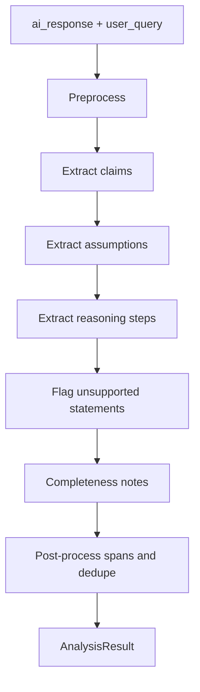

# Phase 3 — Response Analysis Layer

**Goal:** **Explicitly extract** structured artifacts from the AI response: atomic **claims**, implicit **assumptions**, and ordered **reasoning steps**—with stable span offsets for UI anchoring.

**Depends on:** Phase 1 `AnalysisResult` contract, Phase 2 normalized input.

**Feeds:** Phase 3.5 Source Attribution Engine (builds Claim → Reasoning → Source → Evidence per claim).

**Exit criteria:** `/analyze` returns complete extraction JSON; no verification labels and **no scoring** in this phase.

---

## 3.1 What must be explicitly extracted

Phase 3 is **extraction only**. The LLM must output all of the following—never skip silently:

| Artifact | Required | Description |
|----------|----------|-------------|
| **Claims** | Yes | Atomic statements that could be checked or debated |
| **Assumptions** | Yes | Unstated premises required for the answer to hold |
| **Reasoning steps** | Yes | 3–4+ ordered steps from evidence toward conclusion (more allowed if needed) |
| **Unsupported statements** | Yes | Statements in the response with no clear support in text |
| **Completeness notes** | Yes | Brief narrative on what the answer covers vs omits (no scores) |

**Explicit non-goals for Phase 3:**

- No claim verification status (Phase 4, only if user enabled toggle)
- No source linking (Phase 3.5)
- No numeric confidence or quality scores

---

## 3.2 Extraction output (`AnalysisResult`)

```json
{
  "claims": [
    {
      "id": "c1",
      "text": "Users prefer convenience.",
      "span": { "start": 120, "end": 145 },
      "type": "factual | opinion | prediction"
    }
  ],
  "assumptions": [
    {
      "id": "a1",
      "text": "Users prefer convenience.",
      "related_claim_ids": ["c1"],
      "derived_from_hint": "Survey Question 7"
    }
  ],
  "reasoning_steps": [
    {
      "id": "r1",
      "step": "Survey results show a majority favor convenience over price.",
      "order": 1,
      "supports_claim_ids": ["c1"]
    }
  ],
  "unsupported_statements": ["..."],
  "completeness_notes": "Answer cites survey but does not discuss sample size."
}
```

Every claim in the response text should appear in `claims[]` or be called out in `unsupported_statements`.

---

## 3.3 Extraction pipeline



Single structured LLM call is acceptable if the prompt enforces **separate arrays** for claims, assumptions, and reasoning_steps with cross-references (`supports_claim_ids`, `related_claim_ids`).

### Preprocess

- Strip zero-width chars; normalize newlines.
- If response > token budget: chunk by paragraph, extract per chunk, merge with renumbered IDs.

### LLM call pattern

- **System prompt:** “You are an extraction engine. Output only JSON. Extract claims, assumptions, and reasoning steps explicitly.”
- **User content:** `user_query` + `ai_response` + optional `user_context` excerpt.
- **Model:** `LLM_MODEL_ANALYSIS`
- **Temperature:** 0–0.2

### Post-process

1. Deduplicate near-duplicate claims (string equality or embedding > 0.92).
2. Align `span` to original text; if no match, `span: null` + `meta.span_unresolved`.
3. Cap claims at `MAX_CLAIMS`; merge lowest-salience duplicates narratively in `completeness_notes`.

---

## 3.4 Prompt structure (conceptual)

**Must instruct the model to:**

1. List every **claim** as a standalone sentence.
2. List every **assumption** and link `related_claim_ids`.
3. Build **reasoning_steps** in order, each with `supports_claim_ids`.
4. List **unsupported_statements** verbatim or paraphrased from the response.
5. Write **completeness_notes** in plain language (no ratings).

**Few-shot:** Include SNITCH Bangalore example *and* survey/convenience example for assumption + reasoning linkage.

---

## 3.5 Claim typing (for downstream only)

| Type | Phase 3.5 / 4 behavior |
|------|-------------------------|
| `factual` | Eligible for source attribution and (if toggle on) verification |
| `opinion` | Attribution may be thin; note in `attribution_gap` |
| `prediction` | Emphasize uncertainty in notes, not scores |

---

## 3.6 Reasoning graph (internal)

```
reasoning_steps[].supports_claim_ids → claims
assumptions[].related_claim_ids → claims
```

Phase 3.5 walks this graph to build each claim’s chain.

---

## 3.7 Service API

```python
# POST /api/v1/analyze
async def analyze(request: EvaluationRequest) -> AnalysisResult:
    ...
```

**Caching:** Hash `(ai_response, user_query)` → cache 24h.

---

## 3.8 Error handling

| Condition | Behavior |
|-----------|----------|
| LLM invalid JSON | Retry once with repair prompt; else 502 |
| Empty claims | One synthetic claim summarizing the response + note in `completeness_notes` |
| Non-English | Same schema, extracted in source language |

---

## 3.9 Quality checks (dev)

| Sample | Expected extraction |
|--------|---------------------|
| “Open another Bangalore store.” | Claims + assumptions (demand, competition) + 3–4 reasoning steps |
| Survey / convenience paragraph | Claim “Users prefer convenience”, assumption, reasoning citing Q7 |
| Answer with `[1][2]` | Claims + `derived_from_hint` on assumptions where applicable |

---

## 3.10 Tasks checklist

- [ ] `analysis.py` with explicit multi-artifact prompt
- [ ] JSON schema requiring `claims`, `assumptions`, `reasoning_steps` (min items validated)
- [ ] Span alignment utility
- [ ] `/analyze` endpoint + golden fixtures
- [ ] Handoff contract documented for Phase 3.5 (`claim_id`, `step_id` stable)
