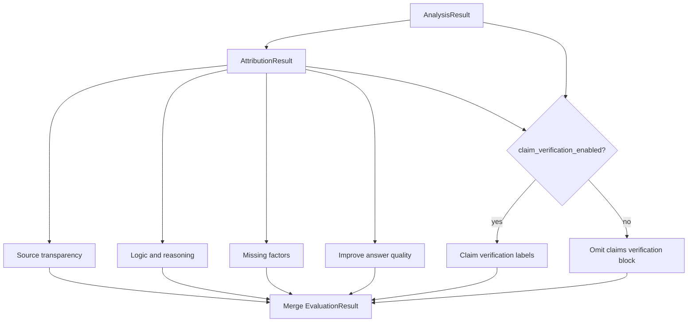

# Phase 4 — Evaluation Engine

**Goal:** Produce **qualitative** outputs for each of the five evaluation dimensions—using Phase 3 extraction and Phase 3.5 attribution chains. **No scoring** anywhere (no confidence, percentages, 1–5 scales, or ranked numeric quality).

**Depends on:** Phase 3 `AnalysisResult`, Phase 3.5 `AttributionResult`, Phase 2 `claim_verification_enabled`.

**Exit criteria:** Each dimension section is populated with narrative/structured content; claim `status` labels appear only when claim verification toggle was on.

---

## 4.1 Orchestration within evaluation



Modules can run **in parallel** after attribution is ready. Claim verification module is **skipped** when `claim_verification_enabled` is false.

---

## 4.2 Claim verification module (toggle-gated)

**Runs only when** `claim_verification_enabled: true`.

### Inputs

- `claims[]`, `attribution.chains[]`
- `source_preferences`, user context, citations, optional search

### Process per claim

1. Use attribution chain (source + supporting/counter evidence) as primary input.
2. If `internal` disabled → do not mark `verified` from model knowledge alone.
3. LLM judge assigns **status label only** (no confidence number):

| Status | When |
|--------|------|
| `verified` | Allowed sources support the claim in attribution chain |
| `needs_verification` | Partial support, gaps, or weak sources |
| `unsupported` | Contradicting evidence in chain |
| `not_applicable` | Opinion-only claim |

### Output constraints (product)

- **Verified:** 1–3 source links in hover (from attribution).
- **Needs verification:** short `verification_note`; no fake links.

When toggle is **off**, return `claims: []` or omit the key; UI does not show Facts & Verification highlights.

---

## 4.3 Source transparency module

Uses `attribution.chains` + `source_preferences`.

| Output | Description |
|--------|-------------|
| `sources_used` | Grouped by category (Memory, Web, …) with concrete items |
| `trust_issues` | Narrative bullets (e.g. “Only blog sources cited”) |
| `missing_source_types` | Categories that would help but were not used |

**No trust scores**—only descriptive issues.

---

## 4.4 Logic & reasoning module

Uses `reasoning_steps`, `attribution.chains`, and assumptions.

| Field | Spec |
|-------|------|
| `conclusion` | One-sentence main conclusion |
| `reasoning_path` | 3–4 steps; each links to attribution `evidence_links` / chain |
| `logical_gaps` | Narrative bullets where conclusion doesn’t follow |
| `alternate_perspectives` | 2–4 bullets |
| `critique` | Short paragraph |
| `key_assumptions` | From analysis/attribution assumption blocks |

**Expandable step detail:** Evidence from attribution `supporting` / `counter` (e.g. Survey Q7: 73% convenience, 19% price).

---

## 4.5 Missing factors module

Structured **compact gap items** for UI—no severity scores, no long text.

Each item is **only** a heading and a **1–2 line** `summary` (enforce ~200 characters max in prompts).

```json
{
  "heading": "Competitor Analysis",
  "summary": "No evaluation of nearby competitors."
}
```

**Do not** emit long descriptions, multi-bullet sub-analyses, or `suggested_context` in this array (regeneration may infer context needs from `summary` + `answer_quality_intent` instead).

Display rules: [Architecture Index §7](./00_Architecture_Index.md#4-missing-factors--display-only-compact).

---

## 4.6 Improve answer quality (narrative only)

**User intent** is collected in the request (`answer_quality_intent`)—not generated here. See [Index §7.5](./00_Architecture_Index.md#5-improve-answer-quality--user-intent-then-regenerate).

When `improve_answer_quality` is in `criteria`, optionally emit brief qualitative notes (1–2 lines each):

```json
{
  "clarity_note": "...",
  "completeness_note": "...",
  "actionability_note": "...",
  "summary": "..."
}
```

**No 1–5 scales.** Notes supplement regeneration; **primary steering** for Phase 5 is `answer_quality_intent`.

---

## 4.7 LLM adapter pattern

```python
class LLMAdapter(Protocol):
    async def complete_json(
        self,
        system: str,
        user: str,
        schema: dict,
        model: str,
    ) -> dict: ...
```

Prompts must forbid numeric scores in model output; validate with JSON Schema (`additionalProperties: false` on score-like fields).

---

## 4.8 Search adapter (optional)

Used for attribution (Phase 3.5) and claim verification when toggle on. Same rate limits as before; results are excerpts, not ranked scores.

---

## 4.9 Tasks checklist

- [ ] Gate claim verification on `claim_verification_enabled`
- [ ] Consume `AttributionResult` in all modules
- [ ] Remove confidence / rubric fields from schemas and prompts
- [ ] Source transparency + logic + missing factors + answer quality (narrative)
- [ ] Schema tests asserting no numeric score fields in responses
