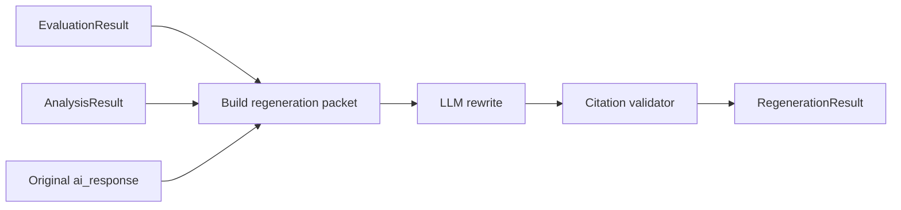

# Phase 5 — Regeneration Engine

**Goal:** Produce an **improved answer** and **summary of changes** using evaluation findings, respecting user source preferences and selected criteria.

**Depends on:** Phase 4 `EvaluationResult`, Phase 3 `AnalysisResult`, Phase 3.5 `AttributionResult`.

**Trigger:** `improve_answer_quality` in criteria AND `regenerate: true`.

**Exit criteria:** Regenerated text addresses listed missing factors and strengthens weak claims without inventing citations.

---

## 5.1 Design constraints

| Constraint | Implementation |
|------------|----------------|
| No fabricated sources | Only cite URLs present in evaluation `sources` or user context |
| Respect disabled sources | System prompt lists allowed `source_type` values |
| Preserve user intent | Pass `user_query` as primary objective |
| Traceability | `changes_summary` maps to evaluation findings |
| Length | Default ≤ 1.5× original unless user opts “expand” (v2) |

---

## 5.2 Regeneration pipeline



### Regeneration packet contents

1. **`answer_quality_intent`** (required for quality rewrite): user intent, expertise level, goal, constraints/expectations, what a good answer looks like
2. Original response (truncated if needed)
3. User query
4. Attribution chains (claim → reasoning → source → evidence)
5. List of claims with status + notes (only if claim verification was enabled)
6. Missing factors (`heading` + `summary` only)
7. Logical gaps + alternate perspectives (for balance)
8. Optional `answer_quality` notes from Phase 4
9. Allowed citation URL whitelist

---

## 5.3 Prompt strategy

**System:**

- You are revising an AI answer to match the user’s stated intent, expertise, goal, constraints, and definition of a good answer.
- Adjust tone and depth to `expertise_level` (plain for beginner, concise technical for expert).
- Use markdown structure (headings, bullets) when `good_answer_looks_like` implies it.
- Mark uncertain claims with explicit uncertainty language.
- Do not cite sources not in the provided whitelist.

**User:**

- Lead with the full `answer_quality_intent` block.
- Address each missing factor `heading` / `summary` where relevant.
- Include “improvements” from `changes_summary` pre-list generated by rule engine (optional pre-step).

**Model:** `LLM_MODEL_REGEN` (highest quality).

**Temperature:** 0.3–0.5 for natural prose while staying grounded.

---

## 5.4 Citation validator (post-LLM)

```python
def validate_citations(text: str, allowed_urls: set[str]) -> list[str]:
    """Return list of invalid URLs found in markdown links."""
```

Strip or replace invalid links; add warning in `meta.regeneration_warnings`.

---

## 5.5 `changes_summary` generation

**Hybrid approach:**

1. **Rule-based:** For each missing factor → one bullet “Added {category}”.
2. **LLM-based:** Short diff summary comparing original vs improved (second micro-call, optional).

Cap at 8 bullets for UI scannability.

---

## 5.6 `recommended_inputs`

Aggregate from:

- `answer_quality_intent` fields (if user left gaps)
- `evaluation.answer_quality` notes
- Unchecked source types that would help (“Enable research sources for industry reports”)

Deduplicate; show in **Improve Answer Quality** section even if user skips regeneration.

---

## 5.7 Standalone endpoint

`POST /api/v1/regenerate`

```json
{
  "evaluation_id": "uuid",
  "override_criteria": ["missing_factors", "claim_verification"]
}
```

Reuses stored analysis + evaluation from DB.

---

## 5.8 Example (SNITCH / Bangalore)

**Original:** “Open another Bangalore store.”

**Improved (outline):**

- Lead with qualified recommendation
- Section: Demand evidence (with provided links only)
- Section: Competitor landscape (gap filled qualitatively if no data)
- Section: Economics & cannibalization caveats
- Section: Explicit assumptions
- Next steps / data needed

**changes_summary:**

- Expanded competitor and cannibalization discussion
- Qualified demand claim; added uncertainty where unverified
- Listed data needed for rent/profitability modeling

---

## 5.9 Tasks checklist

- [ ] `regeneration.py` service + prompt templates
- [ ] Whitelist builder from evaluation sources
- [ ] Citation validator
- [ ] `changes_summary` hybrid generator
- [ ] `/regenerate` endpoint + integration in orchestrator
- [ ] Regression test: no hallucinated domains in output
