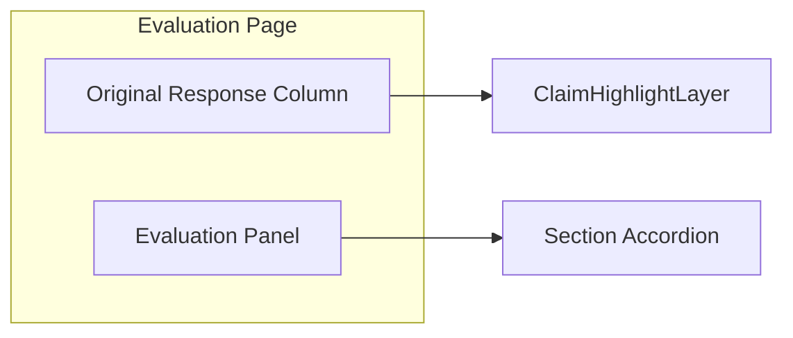

# Phase 6 — UI & Expandable Evaluation Panel

**Goal:** Present evaluation results beside the AI response in an expandable panel with inline highlights, interactive reasoning, and regeneration display.

**Depends on:** Phase 1 TypeScript types, Phase 4–5 API payloads.

**Exit criteria:** Full SNITCH-style demo flow works in browser: paste answer → evaluate → see all sections with correct colors and hovers.

---

## 6.1 Layout architecture



### Desktop (≥1024px)

| Column | Width | Content |
|--------|-------|---------|
| Left | 55% | Original `ai_response` with inline highlights |
| Right | 45% | Collapsible **Evaluation Panel** |

### Mobile

- Stacked: response on top, panel as bottom sheet with drag handle.

---

## 6.2 Panel chrome

| Element | Behavior |
|---------|----------|
| **Default state** | Panel **open/expanded** on page load |
| Header | “Evaluation” + status badge (Processing / Ready / Error) |
| Collapse toggle | Panel width → icon strip; highlights remain on left when verification on |
| CTA | “Evaluate” / “Re-evaluate” / “Regenerate” |
| Progress | Stepper: Analyzing → Attributing → Evaluating → Regenerating |

### Five dimensions (always visible)

On open, render all five section headers and shells—do not hide dimensions behind a picker:

1. Claim Verification
2. Source Transparency
3. Logic & Reasoning Check
4. Missing Factors
5. Improve Answer Quality

### Claim Verification toggle

| State | UI |
|-------|-----|
| **OFF (default)** | Section shows description + toggle; **no** green/yellow highlights on response; Facts content hidden or placeholder until enabled + evaluated |
| **ON** | After evaluate, show verified / needs-verification highlights and hover cards |

Toggle maps to `claim_verification_enabled` on every evaluate request.

---

## 6.3 Section structure (accordion)

Order matches problem statement narrative:

1. **Facts & Verification**
2. **Sources**
3. **Reasoning & Assumptions**
4. **What's Missing?**
5. **Improve Answer Quality** (recommended inputs + regenerated answer)

All five sections are always visible; section **body** fills after evaluate. Claim Verification body (highlights) only when toggle is on.

**No scoring UI** anywhere (no stars, sliders, percentages, or 1–5 controls).

---

## 6.4 Facts & Verification (inline highlights — toggle required)

**Precondition:** `claim_verification_enabled === true` and evaluate has completed.

If toggle is off, skip `ClaimHighlightLayer` entirely.

### Rendering algorithm

1. Sort claims by `span.start` ascending.
2. Walk response string; inject `<mark>` or overlay spans per claim.
3. Overlapping spans: prefer stronger label precedence (`unsupported` > `needs_verification` > `verified`) — not a numeric score.

### Styles (Tailwind tokens)

```css
/* conceptual tokens */
.highlight-verified { background: #d1fae5; }  /* pastel green */
.highlight-pending { background: #fef9c3; }  /* pastel yellow */
```

### Hover card

| Status | Content |
|--------|---------|
| `verified` | 1–3 links (title + domain), one-line justification |
| `needs_verification` | `verification_note` only; optional “Search” external link (v2) |

**Accessibility:** `role="mark"`, `aria-label` with status; keyboard focus opens popover.

---

## 6.5 Sources section

Mirror input checkboxes **with live state** — user can uncheck before re-run:

| UI control | Effect |
|------------|--------|
| Checkbox per category | Updates `source_preferences` local state |
| List under each | Items from `evaluation.source_analysis.sources_used` |
| “Add your own source” | Inline form → append to `custom_sources` |

**Re-evaluate button** when preferences change after initial run.

---

## 6.6 Reasoning & Assumptions

| Sub-block | Data source |
|-----------|-------------|
| Conclusion | `evaluation.logic.conclusion` |
| Reasoning Path | `evaluation.logic.reasoning_path` + `attribution.chains` |
| Key Assumptions | `attribution.chains[].assumption` (Derived From, Supporting/Counter Evidence) |
| Alternate perspectives | `evaluation.logic.alternate_perspectives` |
| Critique | `evaluation.logic.critique` |

Display attribution chain per claim (Claim → Reasoning Step → Source → Evidence) in expandable rows; example: convenience / Survey Q7 / 73% vs 19%.

### Expandable steps

```
▸ Brand awareness is already established
  └ Evidence Used:
      • Existing stores in Bangalore (link)
      • Social media engagement (link)
```

Component: `ReasoningStep` with `useState(expanded)`.

Hyperlinks only from `evidence_links` (verified sources).

---

## 6.7 What's Missing? (dimension 4)

**Display rule:** [Index §7.4](./00_Architecture_Index.md#4-missing-factors--display-only-compact) — **heading + 1–2 lines only.**

```text
⚠️ Competitor Analysis
No evaluation of nearby competitors or their footprint in the target area.
```

| Show | Do not show |
|------|-------------|
| `heading` | Long paragraphs |
| `summary` (max 2 lines) | `suggested_context`, upload chips, sub-bullets |

Optional warning icon before heading. No severity score.

---

## 6.8 Improve Answer Quality (dimension 5)

**Input rule:** [Index §7.5](./00_Architecture_Index.md#5-improve-answer-quality--user-intent-then-regenerate)

### Intent form (shown before / after evaluate; editable)

| Field | Control |
|-------|---------|
| User intent | Textarea |
| Expertise level | Select or text |
| User goal | Textarea |
| Constraints or expectations | Textarea |
| What should a good answer look like? | Textarea |

Maps to `answer_quality_intent` on evaluate/regenerate.

### After run

| Block | Content |
|-------|---------|
| Qualitative notes (optional) | `answer_quality.*_note` — keep brief |
| Regenerated Answer | Markdown renderer; shaped by intent fields |
| Changes summary | Bulleted list with check icons |

**Copy actions:** Copy improved answer, Copy changes summary.

Do **not** use recommended-input lists as a substitute for the intent form in this section.

---

## 6.9 Component tree (reference)

```
App
└── EvaluationPage
    ├── ResponseColumn
    │   └── HighlightedResponse
    │       └── ClaimPopover
    └── EvaluationPanel
        ├── PanelHeader
        ├── CriteriaSelector (Phase 2 form, collapsible)
        ├── SourcePreferences
        └── AccordionSections
            ├── FactsSection
            ├── SourcesSection
            ├── ReasoningSection
            ├── MissingSection
            └── ImproveSection
```

---

## 6.10 Data fetching

```typescript
// hooks/useEvaluation.ts
export function useEvaluation() {
  const evaluate = async (form: EvaluationFormState) => {
    setStatus('processing');
    const res = await api.post('/api/v1/evaluate', form);
    setResult(res.data);
    setStatus('done');
  };
  return { evaluate, result, status, error };
}
```

**Streaming (optional):** SSE events `analysis_complete`, `evaluation_complete`, `regeneration_complete` to update stepper progressively.

---

## 6.11 Error & empty states

| State | UI |
|-------|-----|
| No evaluation yet | Panel shows criteria form only |
| Partial failure | Show completed sections + retry for failed stage |
| Rate limited | Toast + backoff timer |

---

## 6.12 Tasks checklist

- [ ] Page layout + responsive panel
- [ ] `HighlightedResponse` with span rendering
- [ ] Popover for verified / pending claims
- [ ] Accordion sections wired to criteria
- [ ] Reasoning expandable steps
- [ ] Missing factor cards
- [ ] Markdown regenerated answer + copy buttons
- [ ] Source checkbox re-evaluate flow
- [ ] a11y pass (focus trap in popover, color contrast)
