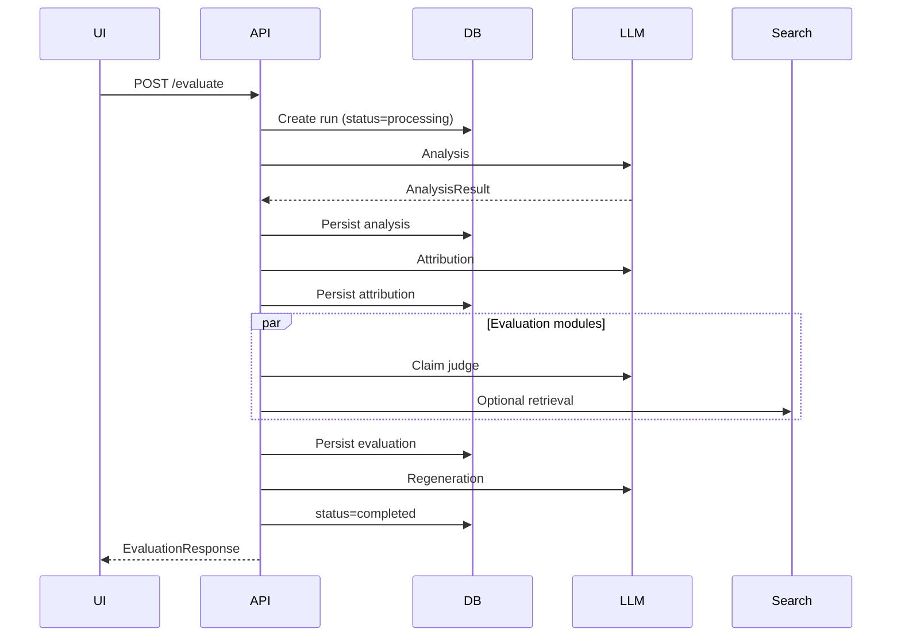

# Phase 7 — Integration, Testing & Deployment

**Goal:** Wire end-to-end flows, enforce quality gates, and deploy a reliable MVP.

**Depends on:** Phases 1–6 complete.

**Exit criteria:** Deployed URL processes real evaluations; monitoring and rollback documented.

---

## 7.1 End-to-end integration



### Orchestrator responsibilities

- Transactional persistence per stage (resume on retry).
- Timeout per stage (analysis 60s, eval 90s, regen 60s).
- Circuit breaker on LLM 5xx (fail fast with friendly error).

---

## 7.2 Persistence schema (minimal)

```sql
-- evaluations
id UUID PK,
created_at TIMESTAMPTZ,
status TEXT, -- processing | completed | failed
request_json JSONB,
analysis_json JSONB,
attribution_json JSONB,
evaluation_json JSONB,
regeneration_json JSONB,
error TEXT,
duration_ms INT

-- uploads
id UUID PK,
filename TEXT,
storage_path TEXT,
extracted_text TEXT,
created_at TIMESTAMPTZ
```

---

## 7.3 Authentication (MVP → production)

| Stage | Approach |
|-------|----------|
| MVP | Anonymous + session cookie rate limit |
| v1.1 | Optional API key header for teams |
| v2 | OAuth (Google) for saved history |

---

## 7.4 Observability

| Signal | Tool |
|--------|------|
| Structured logs | JSON per stage (`evaluation_id`, `stage`, `latency_ms`) |
| Traces | OpenTelemetry spans: `analyze`, `evaluate.claims`, `regenerate` |
| Metrics | Prometheus: `evaluate_duration`, `llm_tokens`, `search_calls` |
| Errors | Sentry with PII scrubbing |

**Dashboards:** p50/p95 latency, error rate, token cost per evaluation.

---

## 7.5 Testing strategy

| Layer | Tests |
|-------|-------|
| Unit | Span alignment, citation validator, schema validation |
| Integration | Mock LLM returning fixtures; full orchestrator |
| Contract | OpenAPI snapshot vs frontend client |
| E2E | Playwright: paste SNITCH example → panel sections visible |
| Eval quality | Offline review set (20 prompts); human labels helpful/not — no numeric scoring |

### CI pipeline (GitHub Actions)

```yaml
# .github/workflows/ci.yml (outline)
jobs:
  backend:
    - lint (ruff)
    - pytest
  frontend:
    - lint (eslint)
    - build
    - playwright (optional on main only)
```

---

## 7.6 Deployment topology

### Option A — Simple MVP

| Service | Host |
|---------|------|
| Frontend | Vercel / Netlify static |
| API | Railway / Render / Fly.io |
| DB | Managed PostgreSQL |
| Files | S3-compatible bucket |

### Option B — Container

- Single Docker image for API; nginx serves frontend build as static.
- `docker-compose.prod.yml` for small VPS.

### Environment matrix

| Env | LLM | Search |
|-----|-----|--------|
| dev | mock or cheap model | disabled |
| staging | production models | limited quota |
| prod | production models | full quota |

---

## 7.7 Configuration & secrets

- Store secrets in platform vault (not git).
- Feature flags: `ENABLE_WEB_SEARCH`, `ENABLE_REGENERATION`.
- Cost cap: `MAX_EVALUATIONS_PER_DAY` per session.

---

## 7.8 Rollout plan

| Week | Milestone |
|------|-----------|
| 1 | Phases 1–3: API + analyze with mock UI |
| 2 | Phase 4: Full evaluation on 5 criteria |
| 3 | Phases 5–6: Regeneration + panel highlights |
| 4 | Phase 7: CI, staging, production hardening |

---

## 7.9 Operational runbook

| Incident | Action |
|----------|--------|
| LLM outage | Return 503 + cached analysis-only mode flag |
| Search quota exceeded | Degrade to user-context-only verification |
| High latency | Enable criteria subset recommendation in UI |
| Bad regeneration | User report button → log `evaluation_id` for review |

---

## 7.10 Tasks checklist

- [ ] DB migrations + repository layer
- [ ] Orchestrator timeouts + partial persist
- [ ] OpenAPI spec published
- [ ] CI workflow
- [ ] Staging environment + smoke test
- [ ] Production deploy + README deployment section
- [ ] Cost monitoring alert on token usage
